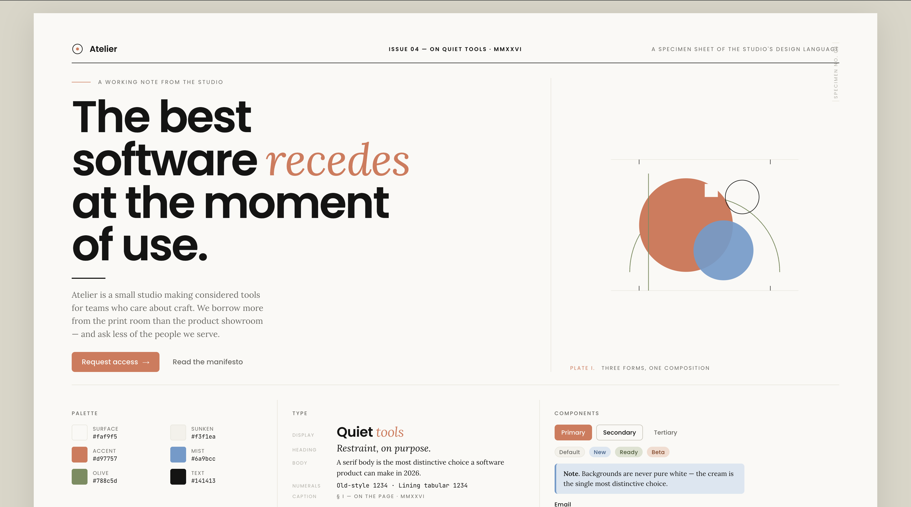

# anthropic-ui-skill

<p align="center">
  
</p>

<p align="center">
  <sub><i>Specimen No. 04 — every primitive in one frame. Open <code>docs/preview.html</code> for the full single-frame poster, or <code>assets/starter.html</code> for the scrollable reference page.</i></sub>
</p>

A drop-in skill, design-token pack, component library, and *posture guide* for building frontends in the visual language and product behavior Anthropic uses across [anthropic.com](https://www.anthropic.com), [Claude.ai](https://claude.ai), and Claude documentation. Warm cream backgrounds, a terra-cotta signature accent, geometric sans-serif headings paired with serif body text, generous whitespace, and quiet, editorial confidence — but also: copy that doesn't flatter, friction placed on purpose, names chosen with care, generated work given its own room, and honesty over reassurance.

The visual style is the easy half. The posture — how the product treats the people using it — is what makes the result actually *feel* like Anthropic.

> Inspiration, not imitation. This project is *inspired by* Anthropic's public design language and writing about it. It is not an official Anthropic product, does not use Anthropic logos or marks, and is not affiliated with Anthropic.

## What's in the box

```
SKILL.md                    Principles, quick-reference, and workflows
references/
  observations.md           Field notes from anthropic.com — what's actually there
  aesthetics-prompt.md      How this skill relates to Anthropic's frontend-aesthetics cookbook
  intent.md                 Posture, voice, naming, friction — the heart of the skill
  tokens.md                 Full token system with rationale
  components.md             Button, input, card, nav, table, modal patterns
  motion.md                 Easing, page-load choreography, scroll reveal
  retrofit.md               Step-by-step restyling for existing projects
  anti-patterns.md          What to avoid — visual, layout, copy, naming, interaction
assets/
  tokens.css                Drop-in CSS custom properties + base styles
  tokens.json               DTCG-format design tokens (Style Dictionary, etc.)
  tailwind.preset.js        Tailwind preset (extends, doesn't replace)
  starter.html              Self-contained reference page set as an essay
docs/
  preview.html              Single-frame design specimen (1600 × 1000)
  demo.png                  Rendered specimen, used by this README
evals/
  evals.json                Test prompts for verifying skill behavior
```

## What this is, and what it isn't

This skill is **one specific theme constraint** — the *Anthropic-editorial* register. It is not Anthropic's general advice for "good frontend." Anthropic publishes a separate [cookbook on prompting for frontend aesthetics](https://github.com/anthropics/claude-cookbooks/blob/main/coding/prompting_for_frontend_aesthetics.ipynb) that advocates *variety* across projects with the only constant being the rejection of AI-slop defaults.

Use this skill when you want the editorial register specifically (research products, writing tools, professional knowledge work, marketing for any of those). Use the cookbook's general prompt when you want variety, or when the project genuinely calls for atmospheric backgrounds and playful personality. Both are valid. See `references/aesthetics-prompt.md` for the longer comparison.

## Quick start

### Use as a Claude Skill

Place this folder where your Claude environment loads skills (or invoke with the path), then ask Claude to design or restyle a frontend in the Anthropic look. The frontmatter on `SKILL.md` describes when the skill auto-applies.

### Use the tokens directly

**Vanilla CSS / any framework**

```html
<link rel="stylesheet" href="assets/tokens.css">
<link rel="preconnect" href="https://fonts.googleapis.com">
<link rel="preconnect" href="https://fonts.gstatic.com" crossorigin>
<link href="https://fonts.googleapis.com/css2?family=Poppins:wght@400;500;600&family=Lora:ital,wght@0,400;0,500;0,600;1,400&display=swap" rel="stylesheet">
```

**Tailwind**

```js
// tailwind.config.js
module.exports = {
  presets: [require('./assets/tailwind.preset.js')],
  content: [/* your paths */],
};
```

**Design-token tooling (Style Dictionary, etc.)**

Point your token build at `assets/tokens.json` — it follows the [Design Tokens Community Group](https://www.designtokens.org/) format.

### See it in action

Open `assets/starter.html` in a browser. It's a self-contained page that demonstrates every primitive in the system — hero, features, quote, articles, components showcase, footer.

## The ten things that matter

If you remember nothing else — in the order that matters:

**Posture (most important)**

1. The user is a collaborator, not a metric.
2. Friction is a feature when the work is consequential.
3. Honesty over reassurance — show provenance and state, not generic disclaimers.
4. Voice is a design surface — `Saved.` is not the same product as `🎉 Awesome!`.

**Composition**

5. Whitespace does the heavy lifting — sections breathe at 96–128px vertical.
6. Editorial layout, not landing-page layout.
7. Give generated work its own room, not a chat bubble.
8. Name things after what they're for. *Haiku · Sonnet · Opus*, not *Free · Pro · Max*.

**Visuals**

9. Cream background, serif body, terra cotta used sparingly, accents that cycle, restrained corners, quiet motion.
10. None of: purple gradients, Inter, `rounded-2xl shadow-xl`, emoji icons, centered-hero / three-card-grid / two-pill-button assemblies.

Skipping any of points 1–4 produces a page that looks Anthropic-adjacent and behaves nothing like it. Skipping points 5–10 produces a page that behaves right but reads as generic. Both halves have to be there.

Full rationale lives in `SKILL.md`, `references/intent.md`, and `references/tokens.md`.

## Contributing

Issues and pull requests welcome. If you propose a new component, anti-pattern, or token, please include the rationale alongside the value — the existing references all explain the *why*, and that's what makes the skill durable.

## License

[MIT](./LICENSE).

## Acknowledgements

Inspired by the public design language of [Anthropic](https://www.anthropic.com). The first-class fonts referenced (Styrene, Tiempos) are commercial; this project ships graceful open-source fallbacks (Poppins, Lora) so it works without licenses.
